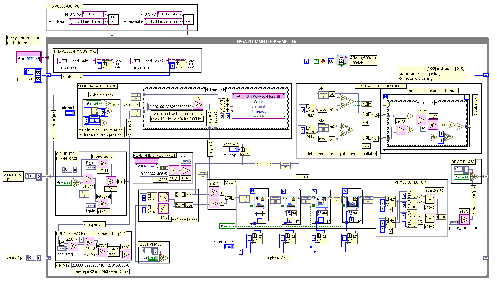
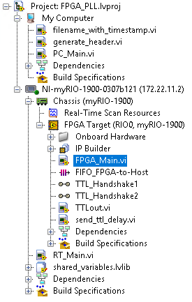

# MyRio Implementation

The top level FPGA code is located in `FPGA_main.vi`. 

The ADC runs at 500 kHz. It is important to keep this timing. The code execution must not take more time than this. A detailed description can be found in the [pdf file](MyRio/Documentation_PLL.pdf).

The project file is the best place to get an overview:

