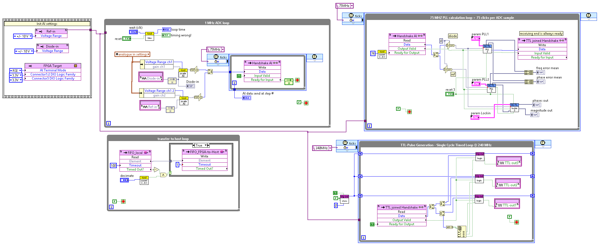

# USB 7856R Implementation

The top level FPGA code is located in `FPGA_main.vi`. It contains several parallel running loops, the most important ones are shown below.

The ADC runs at 1 MHz and is synchronized to the PLL processing loop, which takes 75 steps at 75 MHz for each sample. Inside the 75 MHz loop are two PLLs and a lock-in amplifier.

The PLL in `pll-3ch.vi` (above) is implemented as a [pipeline](https://www.ni.com/docs/en-US/bundle/labview-fpga-module/page/optimizing-fpga-vis-using-pipelining-fpga-module.html), which uses the same hardware to compute three successive PLL phases.

The lock-in amplifier in `lockin-3ch.vi` (below) is just a variant of the PLL code. 

The project file is the best place to get an overview:

